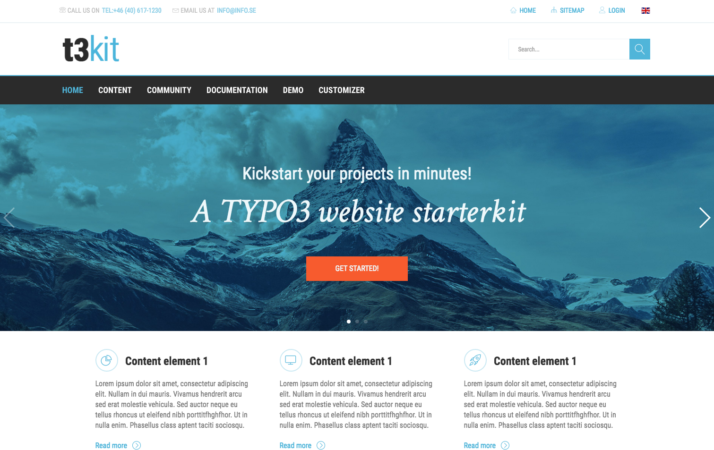

# theme_t3kit

Theme extension, which allows you to style the t3kit theme in backend without coding

### [CHANGELOG](https://github.com/t3kit/theme_t3kit/blob/master/CHANGELOG.md)

***

# Contributing

Everyone can add feedback, bug reports and fixes. Here is several rules for contribute this repository. Please keep this in mind for better cooperation.

## Issues

If you have a question(feature) not covered in the documentation or want to report a bug, the best way to ensure it gets addressed is to file it in the appropriate **issues tracker**. Please check that you've completed the following steps:

* Make sure you're on the right version of **theme_t3kit**
* Make sure that you're cloned all deppendencies `init.sh`
* Used the **search** feature to ensure that the bug hasn't been reported before
* Included as much **information about the bug** as possible, including any output you've received, what OS and version you're on, etc.
* Try to reduce your code to the bare minimum required to reproduce the issue. This makes it much easier (and much faster) to isolate and fix the issue.

## Pull Requests

* Please check to make sure that there aren't existing pull requests attempting to address the issue mentioned. We also recommend checking for issues related to the issue on the tracker, as a team member may be working on the issue in a branch or fork.
* Non-trivial changes should be discussed in an issue first
* Develop in a topic branch, not master
* Follow [Style Guides](#style-guide)
* Follow [Git commit conventions](#git-commit-conventions-and-output-formatting)
* Write a convincing description of your PR and why we should land it

***

## Style Guide
This project uses special style guides. Those rules you can find on appropriate file: `.editorconfig`

* [editorconfig](http://editorconfig.org)

## Git commit conventions and output formatting
Please use semantic labels for your messages, but if commit message is not very important, you can skip labels. All commits with labels will be added in changelog, that's why it is **important to use predefined labels** on your commits.

####Git labels:
* **[FEATURE]** A new feature
* **[FIX]** A bug fix
* **[REFACTOR]** A code change that neither fixes a bug or adds a feature
* **[PERF]** A code change that improves performance.
* **[CHORE]** Changes to the build process (grunt) or auxiliary tools and libraries such as documentation generation and linters (jshint, jscs, etc.)
* **[DOC]** Documentation only changes
* **[STYLE]** Changes that do not affect the meaning of the code (white-space, formatting, missing semi-colons, etc)
* **[TEST]** Adding missing tests
* **[UPDATE]** Updating git submodules, npm/bower dependencies

Please ensure any pull requests of fixes **follow this closely**. If you notice existing code which doesn't follow these practices, feel free to shout and we will address this.

***
